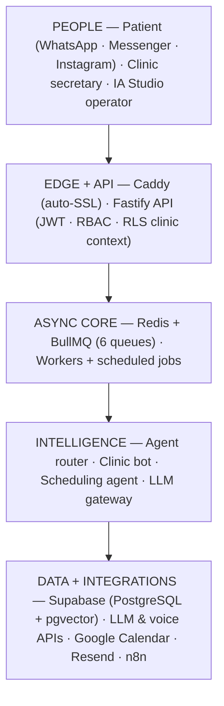
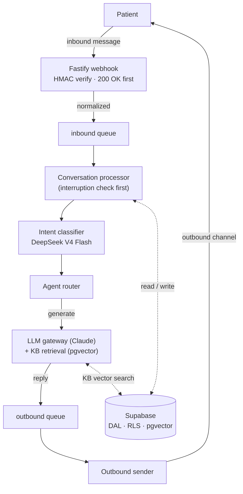
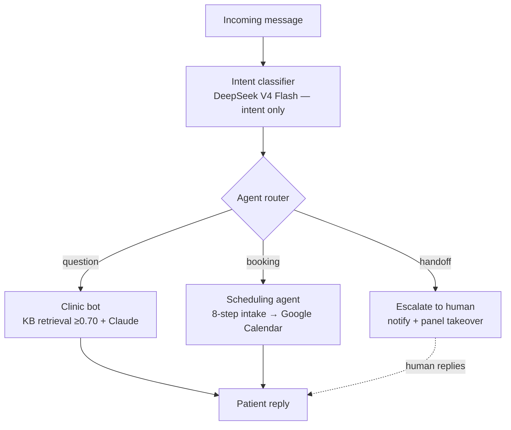
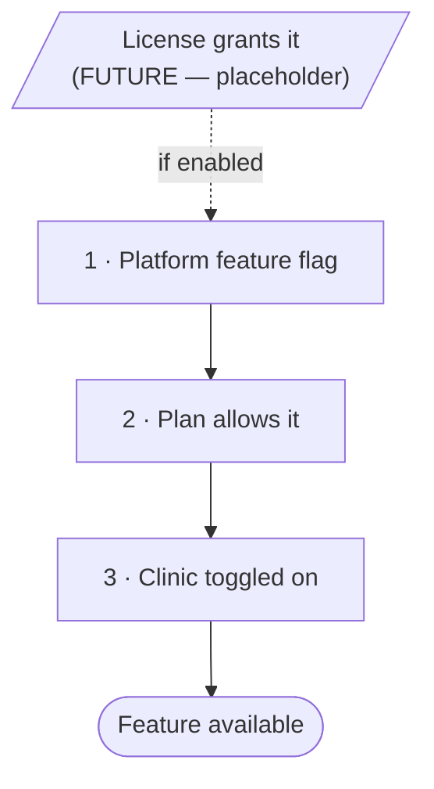
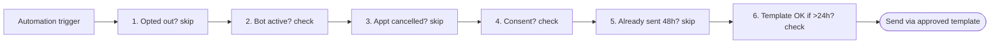
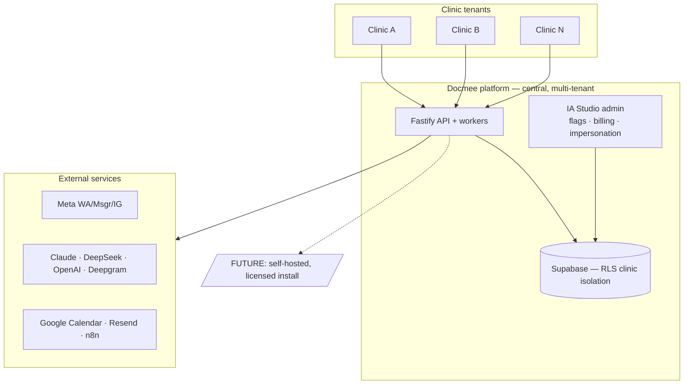

# Docmee — Architecture & Technical Documentation

*AI chatbot platform for medical clinics in Guatemala, delivered over Meta messaging (WhatsApp, Messenger, Instagram). Operated as a central multi-tenant SaaS.*

This document is the full architectural and technical reference, harmonized across the
architecture spec and the design document (A1–A24). Diagrams are provided as Mermaid
(editable; renders on GitHub and most Markdown viewers).

---

## 1. Overview

Each clinic gets an AI bot that answers patient questions from a clinic-specific
knowledge base, books appointments via Google Calendar, and hands off to human
secretaries when needed. Docmee runs as one central, multi-tenant platform with an IA
Studio admin layer; a self-hosted, license-controlled deployment is reserved as a
future commercial mode.

**Operating model:** central SaaS, multi-tenant, strict per-clinic isolation.
**Channels:** WhatsApp at launch; Messenger + Instagram in Rollout 2B.
**Control:** three runtime gates — platform flag → plan → clinic toggle.
**Guiding rule:** soft enforcement — limits block new growth, never a live clinic.

---

## 2. System architecture

A layered architecture: people at the edge, a thin API/edge tier, an asynchronous
processing core, the intelligence (agent) layer, and the data + integrations tier.



The whole stack ships together (pnpm monorepo) behind one Caddy front door. The
load-bearing separation is at the data tier: patient-facing generation routes to
Claude, intent classification to DeepSeek only, embeddings to OpenAI.

---

## 3. Runtime data flow

How a patient message travels in and out. The 200 OK to Meta is returned before any
processing; the bot-interruption check is the first operation in the conversation
processor.



---

## 4. Agent layer

The intent classifier routes each message; the clinic bot answers from the knowledge
base, the scheduling agent books appointments, or the conversation escalates to a
human. Escalation is terminal — a secretary takes over and the bot stops auto-replying.



- **KB grounding only:** below similarity 0.70 the bot does not fall back to general
  LLM knowledge — it acknowledges the gap and offers handoff. The "rules" KB category
  is injected into every system prompt in full.
- **Intake state machine:** stored in the DB, survives mode switches; multi-doctor
  aware (routing by doctor/specialty, per-doctor KB and optional tone).
- **Calendar** is the source of truth for appointment datetime; Docmee DB is the
  source of truth for everything else.

---

## 5. Data model

Forward-only, additive migrations. Every clinic-scoped table carries `clinic_id` with
RLS: `USING (clinic_id = current_setting('app.clinic_id')::UUID)`.

| Domain | Tables |
| --- | --- |
| Tenancy & people | clinics · clinic_users · doctors · user_sessions · auth_events |
| Patients | patients · patient_intake · patient_notes · patient_tags · patient_consent |
| Conversations | conversations · messages · conversation_notes |
| Scheduling | appointments · appointment_status_log |
| Knowledge base | kb_entries (vector) · kb_entry_versions · kb_embedding_jobs · kb_improvement_suggestions |
| Channels & templates | meta_templates |
| Automation | automation_rules · automation_queue |
| Metrics & quality | clinic_metrics · error_log · report_schedules |
| Notifications | notification_preferences · push_subscriptions |
| Integrations | clinic_integrations · integration_events · document_uploads |
| Billing & control | plans · plan_addons · clinic_subscriptions · subscription_usage · invoices · platform_feature_flags |
| Governance | audit_log (append-only) · retention_policies |

**Encrypted fields (pgcrypto):** `patients.phone`, `patients.channel_id`,
`patient_intake.reason`, `patient_intake.special_notes`, `messages.content` (inbound),
and clinic tokens (Meta, Google). Access is via the Data Access Layer (DAL) — no ORM;
agents never hold DB credentials; agent writes are field-level, validated, logged
before execution, and never deletes.

---

## 6. Roles & permissions

| Resource | IA Studio Admin | Clinic Admin | Secretary | Doctor | Assistant |
| --- | --- | --- | --- | --- | --- |
| Conversations | RW | RW | RW | R | R (no reply) |
| Appointments | RW | RW | RW | R | R |
| Patient data | RW | RW | RW | R | R |
| Internal notes | RW | RW | RW | R | — |
| Knowledge base | RW | RW | — | — | — |
| Clinic settings | RW | RW | — | — | — |
| User management | RW | RW | — | — | — |
| Reports/metrics | RW | R | — | R | — |
| Bot mode control | RW | RW | RW | — | — |
| Error review | RW | R | — | — | — |

---

## 7. Control model & soft enforcement

A feature is available only if **all three** runtime gates pass. A fourth license gate
is reserved for the future commercial mode and is not in the active path.



**Soft enforcement (absolute):** quotas, limits, and flags block only *new growth*
(new clinics, seats, feature activation). They must never interrupt a live clinic's
messaging. The patient never sees a system error; every error has a defined outcome;
security errors are never retried.

---

## 8. Channels

WhatsApp at launch; Facebook Messenger and Instagram Direct in Rollout 2B. One WABA +
phone number per clinic (clinics cannot share a number). HMAC validation is
timing-safe; System User tokens for production. All channels normalize to one internal
message schema:

```
{ clinic_id, channel /* whatsapp|messenger|instagram */, patient_identifier,
  message_type /* text|audio|image|template */, content, timestamp, raw_payload }
```

---

## 9. Automation & follow-up engine

A fixed catalog of automations (booking confirmation, 1-day and same-day reminders,
post-consultation, 7-day follow-up, 3-month check-in, review request, no-response,
abandoned-booking recovery, clinic-no-reply). Every automation passes six gates before
it fires.



Cancellation cascades to all pending automations for an appointment. An auto-completion
job runs every 30 minutes, marking appointments complete 30+ minutes after end time and
triggering post-visit automations.

---

## 10. Integrations & n8n bridge

**Philosophy:** Docmee is the source of communication data; external tools are the
destination. Data flows outward; no inbound sync.

- **Google Sheets** export (lead/appointment fields on trigger events) — via the
  integrations Google client.
- **CRM webhook** — POST to a configured URL, HMAC-SHA256 signed, 3 retries with backoff.
- **n8n bridge (workflow customization)** — clinics build arbitrary workflows visually
  in n8n. Docmee exposes event triggers (the CRM webhook surface) and a small **gated
  action API** (send-templated-message, add-note, tag-patient, schedule). n8n
  orchestrates but **cannot bypass** the six automation gates, the
  Meta-approved-template rule, clinic isolation, or opt-out. It is a bridge, not a
  native in-panel builder.
- **Review platform** — link-only; the review-request automation sends the configured URL.

All integration credentials are write-only after initial save.

---

## 11. Notifications

| Priority | Meaning | Channels |
| --- | --- | --- |
| P1 | Emergency, human requested, patient upset — cannot be disabled | panel + email + push (all) |
| P2 | Bot failed, appointment needed, no-response; high-intent leads upgrade P3→P2 | panel + email |
| P3 | New lead, confirmation, audio | panel |
| P4 | Daily digest | email |

**Escalation chain** for unacknowledged urgent alerts: 10 min → assigned secretary ·
20 → all secretaries · 30 → clinic admin · 60 → IA Studio admin. Deduplication: same
type + same conversation within 5 minutes is suppressed. Quiet hours apply to P3/P4
only. Email via Resend.

---

## 12. Queues & workers

**6 queues:** `inbound · outbound · transcription · followup · notification · dead-letter`.

**Workers:** one consumer per active queue (inbound/conversation processor, outbound
sender, transcription, followup/automation, notification, DLQ drain).

**Scheduled jobs:** appointment auto-completion (every 30 min), metrics pre-aggregation,
report schedules. Retry policies per queue; failures route to the dead-letter queue.

---

## 13. Billing & IA Studio control

**Plans:** Starter $99 (500 conv, WhatsApp, 2 users, 1 doctor) · Growth $199 (1,500,
WhatsApp, 5, 1) · Professional $349 (3,000, all channels, 10, 3) · Clinic Plus $549
(6,000, all channels, 20, 10) · Enterprise (custom). **Add-ons:** channel +$29 · doctor
+$19 · priority support +$49 · 500 conversations +$45. **Trial:** 14 days on Growth.
**Usage:** one conversation per period at creation; alert at 80%; overage per plan rate.
**Invoicing:** manual by IA Studio → Stripe later.

**IA Studio:** platform feature flags (all clinics / by plan / by clinic ID, runtime);
impersonation (read-only default, 30-min max, fully logged). **Clinic deactivation:**
pause bot → cancel pending automations → revoke sessions → status inactive →
subscription cancelled → alert admin → audit log.

---

## 14. Deployment & operating model

Central, multi-tenant SaaS. Many clinic tenants share one Docmee platform; per-clinic
isolation is enforced by RLS in the database. A self-hosted, licensed install is a
documented future mode.



---

## 15. Technology stack (locked decisions)

These are final.

| Decision | Choice |
| --- | --- |
| Package manager | pnpm workspaces (monorepo) |
| API framework | Fastify 4+ |
| Database | Supabase (PostgreSQL + pgvector), us-east-1, **no ORM** (DAL) |
| Queue | BullMQ on Redis |
| Primary LLM | Claude Sonnet 4.6 (`claude-sonnet-4-6`) |
| Intent classifier | DeepSeek V4 Flash — intent only, no fallback |
| KB embeddings | OpenAI `text-embedding-3-small` (1536 dims) |
| Transcription | Deepgram Nova-3 |
| Email | Resend |
| Calendar | Google Calendar API (`calendar.events` scope) |
| Frontend | Next.js 14 App Router · shadcn/ui · Tailwind · Zustand · TanStack Query |
| Real-time | Supabase Realtime + WebSocket |
| i18n | next-intl (Spanish default, English toggle) |
| Reverse proxy | Caddy (auto-SSL) |
| License signing | Ed25519 (future commercial mode) |
| Config validation | Zod |
| Language | TypeScript everywhere |
| Migrations | Forward-only, numbered 001–011+ |

**Module boundary rule (ESLint-enforced):** one external SDK per owning module.
`@supabase/supabase-js`→db client; `bullmq`→queue provider; `@anthropic-ai/sdk`→llm
claude provider; `openai`/`deepseek`→llm providers; `resend`→notifications email
channel; `googleapis`→integrations Google client (calendar.ts + sheets.ts submodules);
`deepgram`→channels transcription provider.

---

## 16. Core principles

1. **Soft enforcement** — limits block new growth only, never a live clinic; the patient never sees an error.
2. **Clinic isolation is absolute** — every query/LLM call/vector search scoped to `clinic_id`; RLS is the final layer; `clinic_id` comes from the JWT and never enters a prompt.
3. **Data residency drives LLM selection** — DeepSeek intent-only (no fallback); Claude conversation; OpenAI embeddings.
4. **The LLM is swappable** — nothing calls a provider directly; all via the gateway.
5. **No ORM — DAL only** — explicit allowlist of agent operations; field-level, logged writes; no deletes.
6. **Module boundaries enforced** — one external SDK per owning module.
7. **Migrations forward-only and additive.**
8. **KB grounding only** — no general-LLM fallback below threshold; rules KB injected in full.
9. **Communication records, never medical records.**
10. **Audit log append-only**; appointments/patients never hard-deleted; duplicates merged.
11. **UTC storage**, clinic-local at display; Calendar is source of truth for appointment datetime.
12. **Crash recovery by design** — stateless app; state in DB/cache; resumable.

---

## 17. Future modes (placeholders — not imposed)

- **Commercial license control** — Ed25519-signed licenses, standalone license server, heartbeat worker, and a fourth "license grants" gate. Soft-enforcement contract still applies if enabled.
- **Self-hosted deployment** — Tauri installer + Caddy automation for per-VPS installs, and a control plane for managing many installs.
- **Self-hosted LLM** — Claude now; a RunPod-hosted model is a Rollout-3 cost-optimization path.
- **Native mobile app** — only if the PWA proves insufficient.

---

## 18. Phase plan (rollout backbone)

Rollout phases are the canonical plan; engineering build order is nested as the
construction sequence within each phase (concentrated in Phases 0–1). Each phase has an
acceptance gate before the next begins.

| Phase | Focus | Key items |
| --- | --- | --- |
| 0 — Foundation | Infrastructure | Multi-tenant data model, auth, WhatsApp connection, Meta compliance baseline, receive/send loop |
| 1A — Core Inbox + Bot | Working bot | Per-clinic KB, unified inbox, bot mode, handoff rule, audio transcription, medical-safety rules |
| 1B — Human Inbox | Secretaries + data | Secretary inbox, patient data capture, tags/statuses, internal notes, basic notifications |
| 1C — Scheduling | Calendar | Google Calendar integration, appointment flow, status in inbox, fallback to secretary |
| 2A — Multi-User | Clinic operation | Assignment, alerts, quick replies, IA Studio admin panel, role-based panel, manual invoicing |
| 2B — Channel Expansion | Messenger + Instagram | Channel integration, unified inbox display, channel filtering |
| 2C — History + Follow-up | Retention + automation | Patient history, follow-up automations, review requests, approved templates, consent |
| 2D — Metrics + Errors | Visibility | Metrics dashboard, error review, quality monitoring, automatic reports |
| 3A — Multi-Doctor | Multi-doctor model | Doctor profiles + calendars, doctor/specialty routing, per-doctor KB and tone |
| 3B — Advanced Bot | Controls | Tone control, clinic rules engine, custom flows, internal secretary assistant |
| 3C — Integrations + Docs | Extensibility | Document training, Sheets / CRM / n8n, advanced analytics, scheduled reports |
| 3D — Mobile + Notifications | PWA | PWA install + push, multi-channel notifications (native only if PWA insufficient) |

---

## Appendix — Repository structure (target)

```
docmee/
├── apps/
│   ├── api/                  Fastify API (routes + middleware: JWT + RBAC + RLS context)
│   ├── workers/              inbound · outbound · transcription · followup · notification · dlq  + scheduled jobs
│   └── panel/                Next.js 14 — clinic panel + IA Studio admin (Supabase Realtime + WebSocket, next-intl, PWA)
├── packages/
│   ├── core/                 shared types, logger (PII redaction), secrets, consent/retention helpers
│   ├── db/                   Supabase client, encryption, DAL repositories, full migrations
│   ├── queue/                BullMQ wrapper, 6 queue definitions
│   ├── llm/                  gateway · providers/{claude,deepseek,openai} · prompts/
│   ├── channels/             WhatsApp · Messenger · Instagram · media · Deepgram transcription
│   ├── agents/               intent · router · clinic-bot · kb-retriever · scheduling (multi-doctor)
│   ├── notifications/        dispatcher · email (Resend) · push · escalation · templates
│   ├── automation/           follow-up engine · catalog · six-gate evaluator · scheduler
│   ├── metrics/              pre-aggregation · reporting · report schedules
│   ├── integrations/         google/{client,calendar,sheets} · crm-webhook · n8n-bridge · review-link
│   ├── billing/              plans · subscriptions · usage · invoicing (manual → Stripe)
│   └── features/             feature registry + 3-gate gating (flag → plan → clinic)
├── tests/unit/
└── [future] apps/license-server/ · packages/{license-core,installer-core}
```
